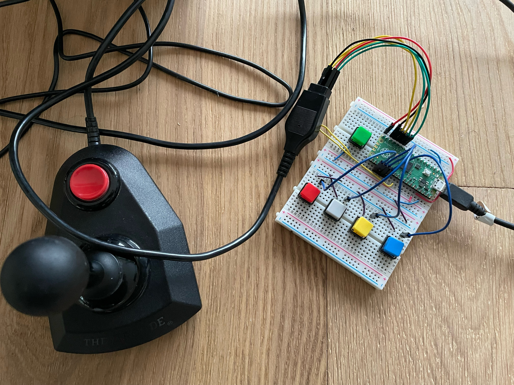
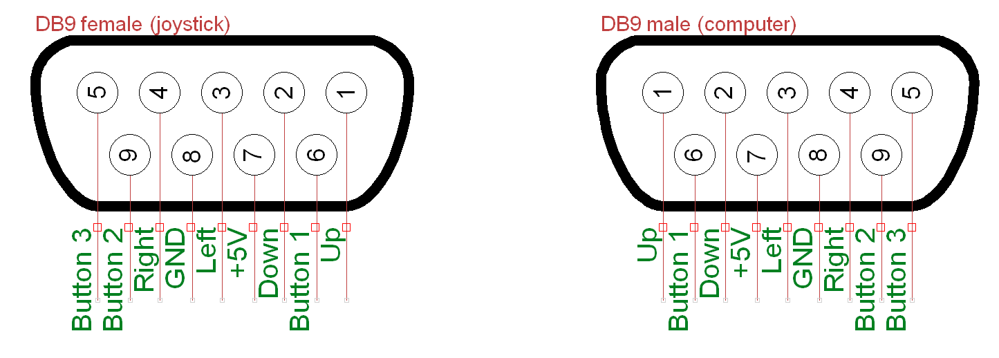

# Commodore64Joystick

This repository contains a C/C++ program to use the Raspberry Pi Pico as an adapter for the original Commodore 64 Joystick. It uses its digital inputs to read the position of the joystick and sends the information over USB to a computer. Four extra buttons were added for more flexibility.

The device manifests itself as a HID joystick for compatibility in games. The polling rate is 1000Hz, but could be higher, since the Pico is very fast.

## Structure

- Main file: [Commodore64Joystick.cpp](Commodore64Joystick.cpp) (Loops continuously)
- Joystick class: [Joystick.hpp](Joystick.hpp) and [Joystick.cpp](Joystick.cpp) (Functions to read the pins, save the state and send over USB)
- TinyUSB files: [tusb_config.h](tusb_config.h) and [usb_descriptors.cpp](usb_descriptors.cpp) (Set the USB device class, name, manufacturer and serial number)

## Installation

Copy the UF2 binary that you can download from the releases onto the Raspberry Pi Pico via USB in BOOTSEL mode. The used pins are defined in the [Commodore64Joystick.cpp](Commodore64Joystick.cpp) file, this shows you which pin on the DB9 connector corresponds to which GPIO pin on the Raspberry Pi Pico. Be aware that the Commodore 64 Joystick only uses Button 1.

### Compiling on Linux
Make sure the Pico C/C++ SDK is installed and available in your PATH (my install location is /usr/share/pico-sdk as defined in [pico_sdk_import.cmake](pico_sdk_import.cmake)). You also need the arm-none-eabi-gcc compiler.

    git clone https://github.com/Pieter-Antonio/Commodore64Joystick.git
    cd Commodore64Joystick
    mkdir build
    cd build
    cmake ..
    make -j4

Finally, copy the generated UF2 file to the Raspberry Pi Pico in BOOTSEL mode.

## Use in another project

If you want to use this code in your own project, you can just copy the Joystick class and the TinyUSB files and call it from your own main function. You should edit the TinyUSB config files to set the USB device name, class, manufacturer and serial number.
